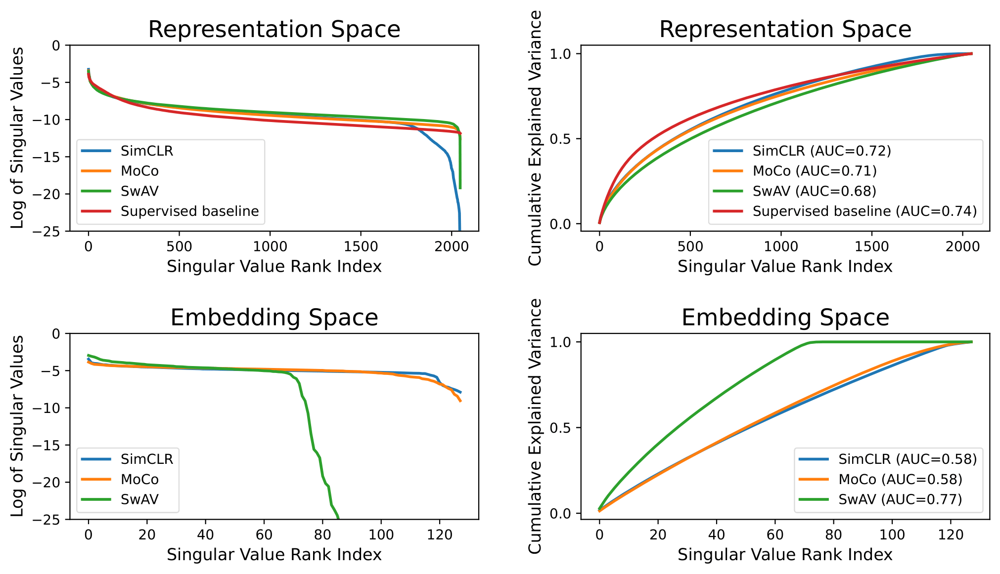

# Exploring Dimensional Collapse in Self-Supervised Video Representation Learning

This repository contains the code for the respective ICLR Tiny Paper 2024.

## Feature Extraction

The supervised baseline follows a [Slow-only](https://pytorch.org/hub/facebookresearch_pytorchvideo_resnet/) 3D ResNet-50 model. For feature extraction, choose your dataset between Kinetics400, UCF101 or HMDB51.

```
python supervised_baseline.py --dataset Kinetics400 --dataset_path /path/to/Kinetics400/videos/val/
```
To inspect dimensional collapse for state-of-the-art self-supervised methods in video representation learning, we computed features of [pretrained](https://github.com/facebookresearch/SlowFast/tree/main/projects/contrastive_ssl) video-based models of SimCLR, MoCo, SwAV and BYOL. Follow the script below for more information. The [SlowFast](https://github.com/facebookresearch/SlowFast/tree/main) codebase is requiered to run the script.

```
python video_ssl.py --method SimCLR --checkpoint /path/to/SimCLR_SlowR50_8x8_T2_epoch_00200.pyth --checkpoint_cfg /path/to/SimCLR_SlowR50_8x8.yaml --dataset Kinetics400 --dataset_path /path/to/Kinetics400/videos/val/
```


## Visualization

Make us of the following script to obtain Singular Value and Cumulative Explained Variance plots for the previously computed feature representations and/or embeddings.
<p align="center">
  
</p>


```
python spectrum_cumulative_plots.py --methods "SimCLR" "MoCo" "SwAV" "Supervised baseline" --representations /path/to/SimCLR/reps /path/to/MoCo/reps /path/to/SwAV/reps /path/to/Supervised/reps --embeddings /path/to/SimCLR/embeds /path/to/MoCo/embeds /path/to/SwAV/embeds
```

## Appendix

Compute feature representations of the [Dense Predictive Coding](https://github.com/TengdaHan/DPC) method as visualized in the appendix. Repository is required and dataset needs to be set up [accordingly](https://github.com/TengdaHan/DPC/tree/master/process_data).

```
python dpc.py --dataset Kinetics400
```


